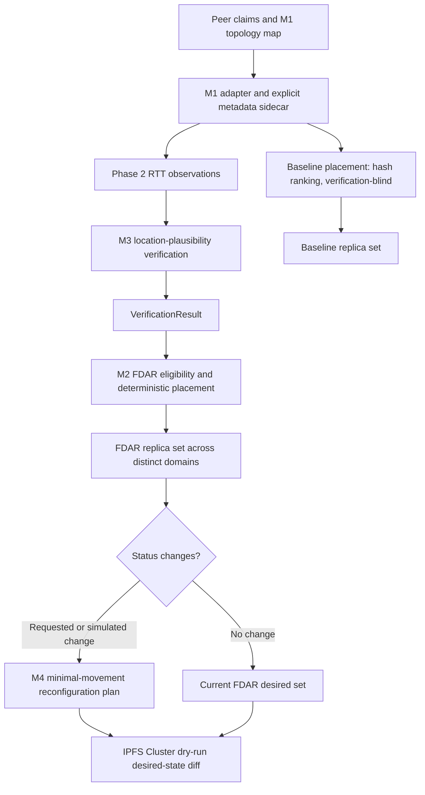

# FDAR Location Verification

FDAR is a research prototype exploring how replica placement in IPFS Cluster could account for both **failure-domain diversity** and **evidence about peers' claimed locations**. It combines a typed M1 reference producer and adapter, RTT measurements, location-plausibility verification, deterministic replica placement, reconfiguration planning, synthetic evaluation, and a safe Cluster dry-run boundary.

This guide explains the project for a new team member. The detailed method and assumptions are linked in [Documentation](#documentation).

## The problem in simple terms

[IPFS](https://ipfs.tech/) is a peer-to-peer system for storing and retrieving content by its content identifier. **IPFS Cluster** coordinates a group of IPFS peers and helps keep selected content pinned on the peers assigned to it.

A **peer** is one machine or IPFS node in that group. A **replica** is one copy of the content kept available on a peer. A **failure domain** is a group of peers likely to be affected by the same physical or infrastructure failure, such as one rack, building, or region.

Suppose we want three copies of a file. Cluster could assign the file to three different peers, but those peers might all be in one building. A building outage could affect all three copies. This is the **diversity problem**: peer diversity does not necessarily mean physical failure-domain diversity.

There is a separate **location-trust problem**. Placement may rely on a peer's claimed region or location without independent evidence that the claim is plausible. A system needs to consider both problems: spread replicas across declared failure domains, and assess location claims cautiously.

RTT means **round-trip time**: how long a network probe takes to travel from a witness to a peer and for the response to return. RTT is affected by routing, congestion, and other network conditions; it is not a direct measurement of geographic distance.

In this project, **FDAR** means *Failure-Domain-Aware Replica placement*. It is a CRUSH-inspired research prototype that prefers eligible peers in distinct configured failure domains and can plan replacements when a replica becomes ineligible.

## Proposed flow



The stages have separate jobs:

1. **Topology and metadata:** M1 describes the declared hierarchy. A separate sidecar supplies coordinates, authorized target hosts, and witness information not present in the M1 tree. A location claim is the peer's asserted coordinates and declared failure domain.
2. **Measurement:** witnesses collect repeated RTT observations to peers. Measurements provide evidence for later analysis; they do not verify a location by themselves.
3. **Verification:** M3 compares observed RTT evidence with an assumed latency envelope for the peer's claimed coordinates and combines evidence from witnesses.
4. **Placement:** M2 applies an eligibility policy and deterministic ranking, selecting no more than one peer in each configured failure domain.
5. **Reconfiguration:** M4 can plan replacements after an explicit status change while preserving still-eligible replicas where possible.
6. **Cluster boundary:** Phase 6 compares current and desired peer sets and reports a dry-run difference. It does not change pins or move data.

## Research modules and implementation phases

Phases 1-6 describe how this repository was developed. M1-M4 describe the research architecture. They overlap, but they are not the same numbering system.

### M1-M4 research architecture

| Module | Purpose, input, and output | Repository implementation and current status |
|---|---|---|
| **M1: Physical topology and failure-domain modeling** | Takes flat peer claims and constructs a hierarchy of regions, ASNs, witnessing zones, racks, and peers, with peer weights and topology verification states. | This repository now contains a typed, deterministic **reference producer** (`m1_builder.py`) and the adapter/consumer. Its output round-trips through the adapter. It is a project-owned implementation, not the absent teammate M1 producer; that external handoff remains unvalidated. |
| **M2: CRUSH-style FDAR placement** | Takes candidate peers, verification decisions, and a failure-domain level; returns a deterministic replica set or an explicit placement shortfall. | Implemented in `placement/`. It uses SHA-256 ranking and one-peer-per-domain selection. It is CRUSH-inspired, not production CRUSH. |
| **M3: Latency-based location verification** | Takes a peer's claimed location and witness-linked RTT evidence; returns a `VerificationResult` with a non-binary status and supporting evidence. | Implemented in `inference/`; consumes Phase 2 observations and explicit coordinates/reliability metadata. It assesses plausibility, not exact physical location. |
| **M4: Verification-aware placement and dynamic reconfiguration** | Takes a previous placement and updated verification/topology state; returns a minimal-movement replacement plan when possible. | Implemented in `placement/reconfiguration.py` and `system.py`. Reconfiguration is a plan after an explicit or simulated change, not a background controller and not a data transfer. |

The expected integration handoff is:

```text
M1 topology_map.json
        -> M1 adapter
        -> M3 verification
        -> M2 FDAR placement
        -> M4 reconfiguration
        -> Cluster dry-run
```

The repository-owned reference-producer and fixture-based synthetic M1 -> M3 -> M2 -> M4 -> Cluster dry-run paths are implemented and tested. The real teammate M1 producer-to-repository handoff is not verified because its source/output is absent.

### Phases 1-6 implementation history

| Phase | What it provides |
|---|---|
| **1: Core models and configuration** | Typed Python contracts, validation, YAML configuration, and logging. Core contracts are dataclasses; Pydantic validates external M1 topology and sidecar input. Models make field meaning and invalid values explicit between modules. |
| **2: Measurement** | Repeated platform-aware ping, timestamped witness-linked observations, descriptive statistics, raw/processed output, and optional traceroute. |
| **3: Verification** | Haversine distance, an assumed latency envelope, residual analysis, evidence quality/reliability, outlier handling, multi-witness fusion, and a `VerificationResult`. |
| **4: Placement and reconfiguration** | Failure-domain topology, eligibility policies, deterministic baseline and FDAR selection, and minimal-movement reconfiguration planning. |
| **5: Evaluation** | Seeded synthetic scenarios, placement/verification/reconfiguration metrics, JSON/CSV records, aggregates, and plots. |
| **6: Orchestration and Cluster safety** | System-level orchestration, reference-producer and fixture-based M1 integration, a desired-state dry-run adapter, and an optional loopback-only read-only Cluster inventory client. |

The M1 hierarchy consumed by this repository is:

```text
Root
└── Region
    └── ASN
        └── witnessing_zone
            └── Rack
                └── Peer
```

Use the term `witnessing_zone`; the adapter does not rename it to `datacenter`. The generic Phase 4 topology model can also represent levels such as `region -> site -> building -> floor`; the M1 adapter maps M1's own levels into placement and uses path-qualified keys so repeated bucket labels under different parents do not collapse into one domain.

## How the phases work

### Phase 1: Contracts and configuration

The shared `PeerClaim`, `Witness`, `MeasurementObservation`, and `VerificationResult` contracts are typed Python dataclasses with value validation. The M1 adapter uses Pydantic to validate the external tree and sidecar. YAML files under `configs/` hold measurement, inference, placement, and Cluster settings. The verifier's possible outcomes are `PLAUSIBLE`, `SUSPICIOUS`, `UNCERTAIN`, and `INSUFFICIENT_EVIDENCE`.

### Phase 2: RTT measurement

A **witness** is a measurement vantage point with an ID, declared coordinates, and reliability metadata. A collector sends repeated ping probes to an authorized peer target and records each successful RTT or failure with a timezone-aware timestamp. Windows, Linux, and macOS ping argument formats are supported; subprocesses use argument arrays rather than a shell.

The raw record preserves each probe's timestamp, RTT or failure reason, and batch/witness identity. Processed features include sample/success/timeout/failure counts, minimum/maximum/mean/median RTT, percentiles including P95 (the 95th-percentile RTT), population standard deviation, jitter, MAD, and packet-loss rate. Here packet-loss rate is calculated from explicit timeouts divided by probe count; other failures are recorded separately. Raw observations and processed features are saved separately in CSV/JSON form.

Traceroute is optional supporting path evidence. It can show responding network hops, but hop output does not establish a peer's physical location or replace RTT verification.

Relevant commands are `experiments/collect_measurements.py` for one target and `experiments/collect_m1_measurements.py` for all peers in a supplied M1 topology from **this machine's witness vantage only**. To obtain independent witness vantage points, each witness must collect its own batches.

### Phase 3: Location-plausibility verification

1. **Haversine distance** estimates the great-circle distance between declared witness coordinates and the peer's claimed coordinates using a spherical Earth model.
2. The **latency envelope** predicts a broad expected RTT range from distance and configurable assumptions. It is an engineering model, not a calibrated law of network latency.
3. A **residual** compares the observed median RTT with the model's expected RTT. Residuals, sample variability, packet loss, and evidence quality help describe how consistent the observations are with the claim.
4. Witness reliability and measurement quality weight each witness. Robust outlier detection flags unusual samples/witnesses and down-weights flagged witness evidence; it does not label a peer malicious.
5. **Fusion** combines evidence from multiple witnesses. Too few usable witnesses yields insufficient evidence; nearby witnesses can be unable to distinguish locations reliably.

The result statuses mean:

- `PLAUSIBLE`: the available evidence meets configured support/quality conditions for consistency with the claim.
- `SUSPICIOUS`: the evidence is sufficiently inconsistent with the claim under the configured model. It is not a finding of malicious intent.
- `UNCERTAIN`: evidence is ambiguous, conflicting, low quality, or affected by the configured short-distance caution.
- `INSUFFICIENT_EVIDENCE`: too few usable witnesses/evidence are available for a meaningful result.

The verifier checks plausibility of a location claim. **It does not cryptographically prove exact physical location.** The confidence/evidence-strength field is an **uncalibrated index, not a probability**. M1's separate `unverifiable_short_range` topology state means distance-based verification cannot reliably distinguish locations; it does not mean a peer is suspicious or malicious.

The `experiments/verify_saved_measurements.py` CLI applies verification to a saved Phase 2 batch. It requires explicit witness and claim coordinates because those coordinates are not inferred from the measurement artifact. `experiments/demo_inference.py` runs a synthetic inference example.

### Phase 4: Failure-domain placement and reconfiguration

Placement groups peers by the configured failure-domain level and requested **replication factor** (the number of copies requested). FDAR applies the verification policy (`strict`, `balanced`, or `permissive`): plausible peers are eligible; suspicious peers are quarantined; uncertain and `unverifiable_short_range` peers are handled according to policy; insufficient evidence is normally ineligible; M1 `untrusted` is quarantined.

The selector uses SHA-256 over object, domain, and peer identifiers for deterministic ranking. FDAR combines that stable rank with configured evidence-preference scores and M1 peer weight. It chooses at most one peer per configured domain. If there are not enough distinct eligible domains, it reports `INSUFFICIENT_DOMAINS` rather than silently violating diversity.

The **baseline** is a comparison path using the same availability and domain constraint but ranking by deterministic hash only; it ignores verification. **FDAR** uses verification-aware eligibility and preference. CRUSH is a family/name for hierarchy-aware deterministic placement ideas; this implementation borrows that style but is not production CRUSH.

M4 reconfiguration rechecks the prior replicas after a status/topology change, preserves eligible replicas when possible, and fills replacement slots deterministically. It reports planned movement only. It does not copy or delete content.

The Phase 4 demonstrations are `experiments/run_placement_simulation.py` and `experiments/compare_placement.py`. Both use synthetic inputs; the comparison does not report empirical accuracy.

### Phase 5: Synthetic evaluation

The evaluation runner uses fixed seeds and generated peers, witnesses, locations, domains, and RTT evidence. Scenarios include all-honest, one/multiple suspicious peers, uncertain peers, domain shortfall, status change, multiple objects, repeated trials, and a coordinate-mismatch distance sweep. It compares baseline with FDAR and reports placement success/diversity, suspicious/uncertain selection and exclusion, separate synthetic location/domain mismatch metrics, and reconfiguration preservation/replacement/movement measures.

The runner writes a manifest, raw JSON/CSV records, aggregated JSON, and nine plots under `data/experiments/`. The distance sweep includes 500 km and longer offsets, but only describes model behavior under generated witness layouts. Detection metrics use generated labels only. **Synthetic evaluation is not real-world validation or an estimate of field accuracy.**

The generated run files are excluded from Git, but a set of clearly labeled synthetic plots is committed for direct viewing in the [Synthetic results gallery](docs/synthetic_results.md).

Run the distance sweep alone with `python experiments/run_evaluation.py --scenario distance_sweep --trials 30 --distance-sweep-km 0,50,250,500,1000,2000,5000,8000,10000,15000`. In a 30-trial run at offsets 500, 1,000, 2,000, 5,000, 8,000, 10,000, and 15,000 km, the configured model flagged 0% at the first four tested offsets, 20% at 8,000 km, and 100% at 10,000 and 15,000 km. These are synthetic scenario frequencies, not a threshold estimate; the run does not support the proposed ~500 km boundary.

### Phase 6: Orchestration and Cluster dry-run

`SystemOrchestrator` calls the verifier for each peer, attaches results to the topology peers, and invokes baseline and FDAR placement. `plan_verification_change()` can pass a changed status to the M4 reconfiguration planner. The M1 CLI composes the M1 adapter, evidence loading/generation, verification, placement, optional status-change plan, and a final desired-state diff.

The in-memory Cluster adapter compares a current peer allocation with a desired replica set. The optional HTTP client reads local peer/pin inventory using loopback GET requests only; it disables proxy use and refuses redirects. **The current Cluster integration does not add/remove pins or move data.** Live mutation is not implemented.

## Example data flow: peer-003

This is a trace through the checked-in **example** topology and sidecar, not actual teammate M1 output or real measurements:

1. **M1 fixture:** `peer-003` is under `REGION_BETA / AS64501 / REMOTE_ZONE_C / RACK_C1`, with weight `1.0`.
2. **Adapter and sidecar:** the adapter preserves the hierarchy and joins `peer-003` by ID to example coordinates and target host. Witness IDs, coordinates, and reliability are also explicitly supplied in the sidecar. No coordinates are derived from bucket names.
3. **Evidence:** in synthetic mode the CLI generates model-based RTT batches; with `--evidence-dir` it loads saved Phase 2 batches for each peer/witness pair and checks IDs and target hosts.
4. **M3 result:** `verify()` returns a `VerificationResult` with status, evidence-strength score, uncertainty, and witness details. Synthetic evidence is not a network observation.
5. **M2 placement:** FDAR chooses peers in distinct path-qualified `witnessing_zone` domains. In the checked-in CLI demonstration, `--simulate-status-change peer-003` explicitly marks that peer `SUSPICIOUS` for the M4 exercise; this injected status is not a claim about real peer behavior.
6. **M4 and Cluster diff:** the planner preserves two replicas and chooses `peer-004` as the replacement. The adapter reports the proposed desired peer set against `current_pin_allocations` (empty in the example sidecar); it performs no pin operation.

## Current status

- Phases 1-6 and an M1 reference producer are implemented in this repository. The producer builds the required hierarchy from typed flat claims and is exercised through the consumer adapter.
- The reference-producer and fixture-based synthetic M1 -> M3 -> M2 -> M4 -> Cluster dry-run paths are implemented and covered by the current test suite (148 passing tests in the latest recorded run).
- M4 output includes a derived M1 tree annotated at peer leaves with M3 status and evidence-strength score; shared bucket states are not overwritten by one peer's result.
- The repository-owned software path now runs from typed flat M1 claims through M3, M2, M4, and a Cluster dry-run. This completes the reproducible software path for this repository's prototype; it does not make the field research empirically complete.
- The authoritative M1 producer and its real `topology_map.json` are not present here. Its actual field names, serialization, and hierarchy therefore have not been validated against this adapter.
- Real authorized distributed measurements have not established location accuracy. Model assumptions and evidence scores remain uncalibrated.
- Cluster pin mutation and data movement are not implemented.
- This is a research prototype, not production IPFS Cluster software.

### Remaining work

**Repository work**

- When real M1 artifacts become available, validate the actual serialized output against the adapter and update only the compatibility boundary if needed.
- Run the integrated flow with the actual M1 topology and matching authorized Phase 2 witness batches.

**Team integration**

- Obtain the authoritative M1 source or a representative `topology_map.json` from its owner.
- Confirm wrapper shape, field names, enum serialization, hierarchy, weights, and verification states.
- Resolve any real producer/consumer mismatch, then exercise M1 -> M3 -> M2 -> M4 -> Cluster dry-run with that output.

**Research and report work**

- If authorized and available, collect geographically distributed witness measurements.
- Document methodology, assumptions, limitations, and benchmark results; separate real observations from synthetic evaluation.
- Prepare the final research discussion and diagrams without claiming accuracy beyond the evidence.

## Run the project

Use Python 3.11 or newer. From the repository root:

```bash
python -m venv .venv
# Activate the environment for your shell, then:
python -m pip install -e ".[dev]"
```

The commands below are available in this repository:

```bash
python -m pytest -q
```

Runs the full test suite. The latest run in the local project environment was **148 passed**; this is a snapshot, not a permanent guarantee.

```bash
python experiments/run_end_to_end_demo.py
```

Runs a synthetic measurement-to-placement demo with a sample reconfiguration and dry-run diff; it makes no network or Cluster request.

```bash
python experiments/run_system.py --dry-run
```

Runs the synthetic system orchestrator; `--dry-run` is required.

```bash
python experiments/run_ipfs_cluster_demo.py --dry-run
```

Shows the Cluster dry-run boundary without sending an HTTP request. The optional `--live` mode reads inventory only and requires the corresponding `ipfs_cluster.enabled` configuration; it has no mutation operation.

```bash
python experiments/run_evaluation.py
python experiments/plot_results.py
```

Runs the seeded synthetic evaluation, then plots the generated raw/aggregate results. Evaluation outputs go under `data/experiments/` by default.

### Run the M1-integrated CLI

`run_full_system.py` requires either an M1 topology or flat claims, a metadata sidecar, exactly one evidence source (`--evidence-dir` or `--synthetic`), and `--dry-run`. To run the repository-owned M1 producer and complete synthetic flow from flat claims:

```bash
python experiments/run_full_system.py \
  --flat-claims examples/m1/flat_peer_claims.example.json \
  --built-topology-output data/m1_system/generated_topology.json \
  --metadata examples/m1/peer_witness_metadata.example.json \
  --synthetic --dry-run \
  --failure-domain-level witnessing_zone \
  --simulate-status-change peer-003
```

This labels the M1 source as the repository-owned reference producer. It does not validate the absent teammate producer. To use the builder alone, run `python experiments/build_m1_topology.py --claims examples/m1/flat_peer_claims.example.json --output data/m1_system/generated_topology.json`.

The existing-tree synthetic adapter smoke test remains available:

Use the example files for a synthetic adapter smoke test:

```bash
python experiments/run_full_system.py \
  --topology examples/m1/topology_map.example.json \
  --metadata examples/m1/peer_witness_metadata.example.json \
  --synthetic \
  --dry-run \
  --failure-domain-level witnessing_zone \
  --simulate-status-change peer-003
```

The command explicitly labels generated RTT as synthetic. To use measurement evidence instead, replace `--synthetic` with `--evidence-dir <directory>` containing a Phase 2 feature JSON for every peer/witness pair. The command does not collect remote witness data itself. The CLI writes JSON to `data/m1_system/system_result.json` by default; use `--output <path>` to select another location.

Real measurement commands are available but perform network probes. Inspect `python experiments/collect_measurements.py --help` or `python experiments/collect_m1_measurements.py --help`, and use only authorized targets and witness vantage points.

## What this project does NOT prove

- RTT does not prove exact GPS or physical location.
- Synthetic evaluation does not establish real-world accuracy.
- Confidence is an evidence-strength score, not a probability.
- CRUSH-inspired ranking is not production CRUSH.
- No live Cluster pin mutation occurs, and no data movement occurs.
- Short-range peers can be inherently difficult to distinguish using latency evidence; `unverifiable_short_range` is a caution state, not an accusation.
- The real teammate M1 producer/output has not been validated in this repository; the added reference producer is a separate implementation.

## Research references and contribution scope

These papers provide conceptual context for multi-witness evidence and decentralized infrastructure trust. This project does not reproduce their methods or use them as evidence for its distance-sensitivity results:

- E. Brito et al., “Decentralized Proof-of-Location for Content Provenance: Towards Capture-Time Authenticity,” IEEE ICSA-C 2026, [DOI](https://doi.org/10.1109/ICSA-C68850.2026.00049), [arXiv:2603.27883](https://arxiv.org/abs/2603.27883).
- F. Castillo et al., “Trustworthy Decentralized Autonomous Machines: A New Paradigm in Automation Economy,” IEEE ICBC 2025, [DOI](https://doi.org/10.1109/ICBC64466.2025.11185065).

The project's research claim should be limited to the prototype combination of declared-domain placement with latency-based plausibility evidence. Novelty against prior work and real-world accuracy require separate literature review and empirical validation.

The repository does not implement or benchmark Filecoin, Cassandra, Copysets, or production CRUSH. Claims that these systems leave the same gap, that IPFS Cluster offers weaker replica guarantees, or that prior work has never combined placement with location verification are research motivations here—not findings established by this codebase. The cited ICSA-C paper is conceptual context; it has not been shown here to independently establish the proposed ~500 km limitation.

## Glossary

| Term | Meaning |
|---|---|
| **IPFS** | A peer-to-peer system for storing and retrieving content by content identifier. Content can be served by peers that hold it. |
| **IPFS Cluster** | A coordinator for groups of IPFS peers that helps keep selected content pinned on assigned peers. This project does not control its pins. |
| **Peer** | A participating IPFS node or machine that may store content. |
| **Replica** | One copy of an object's content held on a peer. |
| **Location claim** | A peer's asserted coordinates and declared failure-domain identity. The project treats these as inputs to assess, not authenticated facts. |
| **Failure domain** | A set of peers that may be affected by one shared failure, such as a rack, site, or region. |
| **Topology** | A structured description of how peers are grouped into physical or administrative domains. |
| **CRUSH** | The name of a hierarchy-aware deterministic placement approach used as inspiration; this repository implements only a small CRUSH-style prototype. |
| **FDAR** | Failure-Domain-Aware Replica placement: the project's approach to preferring replicas across distinct configured domains. |
| **M1** | Research module for physical topology and failure-domain modeling. This repository has a reference producer; the teammate's authoritative producer remains external and unvalidated. |
| **M2** | Research module for deterministic, failure-domain-aware replica placement. |
| **M3** | Research module for RTT-based location-plausibility verification. |
| **M4** | Research module for verification-aware placement and reconfiguration planning. |
| **RTT** | Round-trip time: elapsed time for a probe to reach a peer and its response to return. |
| **Witness** | A measurement vantage point with an identity and declared metadata that observes RTTs to peers. |
| **Haversine distance** | A spherical-Earth estimate of great-circle distance between two coordinate pairs. |
| **Latency envelope** | A configured expected range of RTT values for a claimed distance, including an uncertainty allowance. |
| **Residual** | Difference between observed RTT and the model's expected RTT. |
| **MAD** | Median absolute deviation: the median of absolute differences from a sample median; this project reports unscaled MAD. |
| **Jitter** | In this project, the mean absolute difference between consecutive successful RTT observations. |
| **Verification** | Assessment of whether observations are consistent with a location claim under configured assumptions; it is not proof of location. |
| **`PLAUSIBLE`** | Evidence meets configured conditions for consistency with the claim. |
| **`SUSPICIOUS`** | Evidence is sufficiently inconsistent with the claim under the model; it does not establish malicious intent. |
| **`UNCERTAIN`** | Available evidence is ambiguous, conflicting, low quality, or subject to short-distance caution. |
| **`INSUFFICIENT_EVIDENCE`** | Too few usable observations or witnesses are available for a meaningful assessment. |
| **`unverifiable_short_range`** | M1 topology caution that latency cannot reliably distinguish location at the relevant short range; it is not a suspicious or malicious label. |
| **Reconfiguration** | A plan to preserve eligible replicas and select replacements after a status/topology change. It does not move data. |
| **Dry-run** | A calculation or representation of desired changes without applying them to IPFS Cluster. |
| **Synthetic evaluation** | A seeded experiment using generated peers, locations, witnesses, and measurements; it is not real network validation. |

## Documentation

- [Complete project dossier](docs/PROJECT_DOSSIER.md)
- [Synthetic results and plots](docs/synthetic_results.md)
- [Architecture](docs/architecture.md)
- [M1 adapter and sidecar format](docs/m1_adapter.md)
- [Measurement engine](docs/measurement_engine.md)
- [Inference engine](docs/inference_engine.md)
- [FDAR placement and reconfiguration](docs/fdar_engine.md)
- [Evaluation engine](docs/evaluation_engine.md)
- [System and Cluster integration](docs/system_integration.md)
