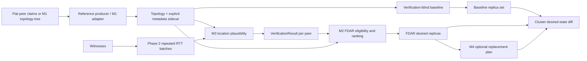

# FDAR Location Verification — Project Dossier

**Document purpose:** a consolidated handover, implementation, and research-status guide for the repository.

**Project title:** *Failure-Domain-Aware Replica Placement with RTT-Based Location-Plausibility Verification for IPFS Cluster* (short name: **FDAR Location Verification**).

**Repository package:** `fdar-location-verifier` 0.1.0. **Project type:** Python research prototype. **Current scope:** measurement evidence, location-plausibility inference, failure-domain-aware placement, reconfiguration planning, synthetic evaluation, and a read-only/dry-run IPFS Cluster boundary.

> **Status summary.** The repository contains a reproducible software path from typed topology claims through verification, placement, reconfiguration planning, and Cluster desired-state diff. It does not establish field accuracy, validate the missing external M1 producer, mutate IPFS Cluster pins, or move content. The README records the latest test run as 148 passing tests; this dossier did not rerun the suite.

## 1. What we are working on

IPFS Cluster helps coordinate which peers keep pinned copies of content. Replication alone does not ensure that copies survive a shared physical failure: three peers can all be in one building, rack, or region. Placement also depends on the correctness of topology claims. A peer may claim to belong to a failure domain or geographic location that is not independently verified.

This project prototypes a pipeline that combines two signals:

1. **Declared hierarchy and failure-domain labels** describe where a peer is said to sit in the infrastructure.
2. **Repeated RTT observations from witnesses** provide evidence about whether a peer's claimed coordinates are plausible under an explicit latency model.

The system uses that evidence to rank or exclude candidates while selecting replicas across distinct configured domains. If a selected replica later becomes ineligible, it can calculate a replacement plan that preserves valid replicas when possible.

The intended benefit is more explainable, verification-aware replica placement. The code does not prove exact physical location: network RTT is affected by routing and congestion, and both witness and topology metadata are external inputs.

## 2. Problem, current practice, and proposed approach

### Present problem

- Peer identity diversity is not the same as infrastructure diversity. Multiple peers may share power, network, building, or regional failure risks.
- A placement algorithm can only use the failure-domain labels it receives; incorrect labels undermine the resulting diversity.
- RTT is a noisy and indirect signal. A single observation cannot reliably establish physical distance, and close locations may be indistinguishable.
- Existing project scope has no authenticated source of peer coordinates, witness identities, or physical-domain membership.
- There is no supplied production M1 artifact, authorized distributed witness dataset, or available Cluster instance to validate the entire system in the field.

### Present solution in the repository

The repository includes basic deterministic replica selection, evidence collection and analysis, configurable verification policies, and an explicit M1-to-Cluster software path. A verification-blind baseline provides a comparison against the proposed verification-aware selector. Evaluation tooling uses seeded generated scenarios; it is not a live-network or production benchmark.

### Proposed solution

The proposal is **FDAR** (*Failure-Domain-Aware Replica placement*): assess location claims using multi-witness RTT evidence, then combine verification status and quality with deterministic placement across distinct declared failure domains. A small SHA-256-based selector is CRUSH-inspired; it is not the production CRUSH algorithm. The system reports shortfalls when eligible distinct domains cannot satisfy the requested replication factor rather than silently choosing multiple peers from one domain.

## 3. Research modules and implementation stages

M1–M4 are the project/research module names; Phases 1–6 describe repository implementation stages. They are related but not interchangeable.

| Module / phase | Responsibility | Current implementation |
|---|---|---|
| **M1 / Phase 1** | Model peer claims, topology, failure domains, and shared data contracts. | Typed data models, config validation, a repository-owned deterministic reference topology producer, and an adapter for the documented M1 tree schema. The external teammate's authoritative producer/output is absent and unvalidated. |
| **Phase 2** | Collect observations and preserve evidence. | Platform-aware repeated ping, timezone-aware observation records, feature extraction, CSV/JSON persistence, and optional traceroute support. Each witness runs its own collector; remote witness orchestration is not implemented. |
| **M3 / Phase 3** | Judge whether RTT evidence is consistent with a location claim. | Haversine distance, a configurable latency envelope, residual and evidence-quality analysis, outlier flagging, reliability-weighted fusion, and four result statuses. This is plausibility analysis, not proof. |
| **M2 / Phase 4** | Select replicas under verification and failure-domain constraints. | Baseline and FDAR deterministic selection, strict/balanced/permissive eligibility, domain-diversity enforcement, metrics, and explicit insufficient-capacity outcomes. |
| **M4 / Phase 4** | Re-plan after topology or verification changes. | Minimal-movement replacement planning that preserves eligible replicas and fills open slots deterministically. It does not transfer data. |
| **Phase 5** | Evaluate behavior and compare the baseline with FDAR. | Seeded synthetic scenario generation, metrics, aggregation, JSON/CSV records, and nine plots. This evaluates model behavior under generated assumptions. |
| **Phase 6** | Compose the system and define Cluster integration boundary. | System orchestrator, M1 pipeline, desired-state dry-run adapter, and optional loopback-only read-only Cluster inventory client. No mutation API exists. |

## 4. End-to-end pipeline



### Pipeline details

1. **Build or load topology.** Input is either flat claims passed to the project-owned M1 reference producer or a tree matching the documented adapter schema. M1's expected hierarchy is `Root → Region → ASN → witnessing_zone → Rack → Peer`.
2. **Join metadata explicitly.** A sidecar maps each peer ID to claimed latitude/longitude and an authorized target host, and each witness ID to its coordinates, endpoint, and declared reliability. These are not derived from bucket names. M1's topology remains the authority for declared domain labels.
3. **Collect or load evidence.** Each witness probes target peers repeatedly and saves raw observations plus processed statistics. Integrated real runs load those saved batches. Alternatively, a clearly labeled synthetic mode creates model-based evidence for integration demos.
4. **Verify each claim (M3).** For each witness, calculate great-circle distance from witness coordinates to the claimed coordinates, predict an assumed RTT band, compare the observed median with that band, assess data quality and reliability, flag outliers, and fuse usable witnesses. Produce a `VerificationResult` with status and supporting evidence.
5. **Select a baseline and FDAR set (M2).** The baseline ranks by deterministic object/domain/peer hash and ignores verification. FDAR applies status-based eligibility and verification preference, then accepts at most one peer per configured failure domain until it reaches the replication factor.
6. **Optionally reconfigure (M4).** Given an explicit changed status or topology, retain still-eligible replicas and rank replacements for missing slots. This is a plan, not an operation.
7. **Compare with Cluster state.** The dry-run layer compares current allocations with desired peers and renders a diff. The optional live client only makes loopback GET requests for inventory and refuses redirects. It does not pin or unpin content.
8. **Evaluate separately (Phase 5).** Generated actual/claimed labels and generated RTTs are used to assess behavior across scenarios; these records must not be described as real measurement accuracy.

## 5. Terms and glossary

| Term | Meaning in this project |
|---|---|
| **IPFS** | Peer-to-peer content addressing and retrieval; content is identified by a content identifier (CID). |
| **IPFS Cluster** | A coordinator for IPFS peers that helps maintain pin allocations. This project does not change those allocations. |
| **Peer** | An IPFS node/machine that can store and serve content. |
| **Replica** | One copy of content on a peer. Replication factor is the number of desired copies. |
| **Failure domain** | A group such as a rack, building, site, or region whose peers may share a failure cause. |
| **Topology** | A hierarchy and peer-to-domain mapping; here it is declared metadata and is not authenticated by the verifier. |
| **M1** | Physical topology and failure-domain modeling module. |
| **M2** | Deterministic FDAR placement module. |
| **M3** | RTT-based location-plausibility verification module. |
| **M4** | Verification-aware reconfiguration planning module. |
| **Phase 1–6** | Repository implementation stages; see the preceding table. |
| **FDAR** | Failure-Domain-Aware Replica placement, the project's proposed placement approach. |
| **CRUSH** | A hierarchy-aware deterministic placement algorithm family that inspires aspects of this prototype. The implementation is not production CRUSH. |
| **RTT** | Round-trip time: elapsed time for a probe to reach a target and its response to return. |
| **Witness** | A measurement vantage point that probes peers and contributes evidence. Its identity, coordinates, reliability, and independence are assumed inputs. |
| **Haversine distance** | Spherical-Earth great-circle distance calculated from two latitude/longitude pairs. It does not validate either coordinate. |
| **Latency envelope** | Configurable expected RTT range at an assumed distance, widened by an uncertainty allowance. It is an engineering model, not a law of network latency. |
| **Residual** | Observed median RTT minus the model's expected RTT center. |
| **MAD** | Median absolute deviation, an unscaled robust measure of spread used alongside jitter. |
| **Jitter** | Here, mean absolute difference between consecutive successful RTT observations. |
| **Evidence strength / confidence** | A bounded, uncalibrated summary index combining evidence coverage, agreement, and directional strength; it is not a probability. |
| **`PLAUSIBLE`** | Available evidence satisfies configured consistency and quality thresholds. |
| **`SUSPICIOUS`** | Evidence sufficiently contradicts the claim under configured assumptions; not a determination of intent or fraud. |
| **`UNCERTAIN`** | Evidence is ambiguous, conflicting, low quality, or subject to short-distance caution. |
| **`INSUFFICIENT_EVIDENCE`** | Too few usable witnesses or observations for a meaningful assessment. |
| **`unverifiable_short_range`** | M1 topology caution that the declared physical separation cannot be established at short range; it is distinct from M3 suspicious status. |
| **Baseline** | Verification-blind deterministic hash placement over the same configured domain constraint. |
| **Dry-run** | Calculation/display of proposed state changes without applying them. |
| **Synthetic evaluation** | A repeatable experiment over generated witnesses, peers, labels, and measurements; not field data. |
| **Ground truth** | Known generated actual/claimed labels within a synthetic scenario only. There is no field ground truth in this repository. |

## 6. Verification method and current configuration

### M3 method

- Haversine distance uses mean Earth radius 6371.0088 km.
- The expected RTT center is `max(minimum_rtt, baseline_rtt + propagation_factor × distance)`. The uncertainty band widens with distance.
- The observed median RTT is compared with the expected band; MAD and jitter describe variability. Measurement completeness, stability, and timeout loss contribute to quality.
- Robust median/MAD-based outlier checks flag unusual samples or witnesses. Outliers remain inspectable and receive reduced fusion weight; an outlier is not evidence of maliciousness.
- Witness contributions are weighted by measurement quality and declared reliability, then fused. The default minimum is two usable witnesses for a non-insufficient result; group outlier marking requires at least three.
- Short-distance caution can produce `UNCERTAIN` even when RTT fits the expected band. The default Phase 3 caution is 50 km; it is a prototype setting, not a validated physical boundary.

### Important defaults (`configs/default.yaml`)

| Area | Default | Interpretation |
|---|---:|---|
| Ping sample count | 50 | Default standalone collector batch size. |
| Ping timeout / interval | 2.0 s / 0.2 s | Probe settings; real elapsed time can vary by OS. |
| Latency baseline | 8 ms | Assumed route/access/processing component. |
| Propagation factor | 0.01 ms/km | Idealized fiber-related scale; not actual route distance. |
| Latency uncertainty | 15 ms plus 2 ms/100 km | Assumed tolerance band. |
| Minimum samples for full completeness | 10 | Quality score setting. |
| Outlier robust-z threshold | 3.5 | Statistical flag threshold, not a maliciousness cutoff. |
| Minimum witnesses for fusion | 2 | Fewer usable witnesses produces insufficient evidence. |
| Plausible / contradiction threshold | 0.65 / 0.65 | Evidence-index decision settings, not calibrated probabilities. |
| Minimum agreement / coverage | 0.55 / 0.45 | Requirements for decisive outcomes. |
| Replication factor | 3 | Default requested replica count. |
| Failure-domain level | `building` | Generic placement default; M1 integrated CLI may choose `witnessing_zone`. |
| Verification policy | `balanced` | Allows uncertain peers conditionally with a reduced preference. |
| FDAR score weights | confidence .30; agreement .25; quality .20; hash .25 | Tunable preference weights; no empirical optimality claim. |
| Cluster integration | disabled, dry-run, loopback URL | Safe default; live option remains read-only. |

These settings are engineering assumptions. Real deployment requires a calibration dataset and sensitivity analysis before choosing thresholds or interpreting output as performance.

## 7. Placement, eligibility, and reconfiguration

| Policy | `PLAUSIBLE` | `UNCERTAIN` | `SUSPICIOUS` | `INSUFFICIENT_EVIDENCE` |
|---|---|---|---|---|
| strict | Eligible | Ineligible | Quarantined | Ineligible |
| balanced | Eligible | Conditional, reduced preference | Quarantined | Ineligible |
| permissive | Eligible | Eligible, reduced preference | Quarantined | Ineligible |

Unavailable peers are ineligible under every policy. M1 `untrusted` is quarantined. M1 `unverifiable_short_range` is handled by its own strict/balanced/permissive setting and does not get rewritten as suspicious. Phase 3 suspicious/insufficient evidence takes precedence over short-range allowance.

The selector hashes object ID, domain key, and peer ID with SHA-256 for stable ranking. FDAR applies configured evidence preference and M1 positive peer weight; baseline uses the same domain/availability constraints but no verification preference. At most one peer is selected per configured domain. If the number of eligible distinct domains is below the requested factor, the result reports `INSUFFICIENT_DOMAINS`; an empty eligible pool reports `NO_ELIGIBLE_PEERS`.

Reconfiguration preserves eligible prior peers without domain collisions and deterministically fills missing slots. The result records movement/replacement and any inability to repair the set. It does not copy bytes, delete replicas, invoke IPFS, or estimate transfer time.

## 8. Testing and work completed

### Test coverage present

The checked-in `tests/` suite contains focused tests for:

- Configuration parsing and contracts/models.
- Ping parsing, traceroute, collection, measurements, statistics, and storage.
- Haversine distance, latency envelopes, residuals, reliability, outlier handling, fusion, and verification statuses.
- M1 builder, M1 adapter, M1 integration and end-to-end system orchestration.
- Placement, eligibility policies, determinism, failure-domain diversity, shortfall cases, and reconfiguration.
- Synthetic evaluation, metric semantics, and generated scenarios.

The project README reports **148 tests passing** in the latest recorded suite run. It also states that the repository-owned reference producer and fixture-based M1 → M3 → M2 → M4 → Cluster dry-run path are covered. These are repository-recorded results; this document has not rerun tests, and there is no CI log or run timestamp cited here. To reproduce locally, use `python -m pytest -q` from this project directory.

### Representative cases explicitly exercised

- Platform-aware ping argument construction and output parsing, including timeout/failure behavior.
- Repeated collection preserves failed observations; statistics handle empty/no-success batches without inventing zero RTT.
- Verification returns distinct plausible, suspicious, uncertain, and insufficient-evidence outcomes under fixtures.
- Low measurement coverage and too few witnesses prevent an unjustified decisive result.
- Outlier records are retained, down-weighted, and not treated as malicious labels.
- Deterministic selection repeats for the same object/topology/configuration.
- Baseline may select a suspicious peer while FDAR quarantines it; all-honest equal-evidence cases can align.
- Duplicate peers within one configured domain do not satisfy multiple replica slots; insufficient domain capacity is reported.
- Strict, balanced, and permissive handling of uncertain and short-range peers is tested.
- Reconfiguration preserves valid replicas and reports replacement/movement or an incomplete repair.
- Adapter checks schema, hierarchy, IDs, sidecar coverage, evidence identity/target consistency, and exact M1 state handling.
- System integration checks verification-to-placement composition and Cluster dry-run semantics.
- Evaluation metrics distinguish generated labels from descriptive placement outcomes.

These examples summarize test intent and checked-in test names; they do not assert the suite was rerun as part of preparing this dossier.

## 9. Results and benchmarking

### What has been measured

1. **Functional correctness:** unit and integration tests, with 148 passing reported by the repository's README.
2. **Synthetic system evaluation:** a previously generated Phase 5 run used 12 generated peers, 5 generated witnesses, 30 generated measurements per witness, replication factor 3, 10 trials, 5 seed values, and scenarios including honest, suspicious, uncertain, domain shortfall, status change, multiple objects, repeated trials, and distance sweep. Its manifest, raw JSON/CSV records, and aggregates remain local under ignored `data/experiments/`; a set of explicitly labeled plot images is committed in the [Synthetic results gallery](synthetic_results.md).
3. **Synthetic distance sensitivity:** the documentation records a separate 30-trial run with 0–15,000 km offsets. For offsets 500, 1,000, 2,000, and 5,000 km it flagged 0%; at 8,000 km 20%; at 10,000 and 15,000 km 100%. This is generated behavior under a chosen model, generated witness layout, and noise, not an estimate of real accuracy. It does not support a proposed ~500 km verification boundary.
4. **Local measurement artifact:** one checked-in raw/processed record is present. The docs identify this as loopback connectivity data, not geographic evidence; it is not included in synthetic evaluation ground truth.

### What has not been benchmarked

- No empirical location accuracy, false-positive/false-negative field rates, or calibrated confidence.
- No independent multi-region witness campaign.
- No throughput, CPU/memory, placement latency, network overhead, or scale benchmark.
- No bytes moved, repair completion time, or availability comparison under real failures.
- No live IPFS Cluster mutation or production CRUSH comparison.
- No baseline comparison against Filecoin, Cassandra, Copysets, or another production system.

Therefore, use “synthetic evaluation” or “functional test result,” not “real-world benchmark,” in reporting. The 148-test number is a test-suite count, not system performance.

### Reproduce evaluation and view outputs

From `location-verification/`:

```powershell
python experiments/run_evaluation.py
python experiments/plot_results.py
```

Default artifacts go under `data/experiments/`: `evaluation_manifest.json`, `raw/evaluation_records.json` and `.csv`, `aggregated/evaluation_summary.json`, and `plots/` PNG files. Open the PNGs in that directory to inspect charts; inspect raw records and aggregate summaries for numeric values and their scenario labels. The manifest records configuration and seeds. Do not compare timestamp metadata as a measured performance result.

For a controlled distance sensitivity run:

```powershell
python experiments/run_evaluation.py --scenario distance_sweep --trials 30 --distance-sweep-km 0,50,250,500,1000,2000,5000,8000,10000,15000 --output-dir data/experiments/distance_sweep
python experiments/plot_results.py --input data/experiments/distance_sweep/raw/evaluation_records.json --aggregated data/experiments/distance_sweep/aggregated/evaluation_summary.json --output-dir data/experiments/distance_sweep/plots
```

## 10. How to install and run

Use Python 3.11 or newer from the project root:

```powershell
python -m pip install -e ".[dev]"
```

### Main demos

```powershell
python experiments/run_end_to_end_demo.py
python experiments/run_system.py --dry-run
python experiments/run_placement_simulation.py
python experiments/compare_placement.py
```

The end-to-end/system examples use deterministic synthetic evidence and in-memory dry-run state. Default system output is under `data/system_demo/`.

### Full M1 reference-producer integration demo

```powershell
python experiments/run_full_system.py `
  --flat-claims examples/m1/flat_peer_claims.example.json `
  --built-topology-output data/m1_system/generated_topology.json `
  --metadata examples/m1/peer_witness_metadata.example.json `
  --synthetic --dry-run --failure-domain-level witnessing_zone `
  --simulate-status-change peer-003
```

This exercises the repository-owned reference producer and synthetic fixture flow; it does not validate the external teammate's M1 implementation.

### Run against supplied M1 and saved real evidence

```powershell
python experiments/run_full_system.py `
  --topology <path-to-topology_map.json> `
  --metadata <path-to-peer-witness-metadata.json> `
  --evidence-dir <directory-containing-phase2-feature-json> `
  --dry-run --failure-domain-level witnessing_zone
```

Every peer/witness batch must be present and match IDs and authorized target hosts. This command does not collect remotely. Each witness must independently run collection and transfer its saved batch to the evidence directory.

### Collect authorized measurements

```powershell
python experiments/collect_measurements.py --target-host <authorized-host> --target-peer-id peer_07 --witness-id witness_1
```

For one witness vantage over an M1 topology:

```powershell
python experiments/collect_m1_measurements.py `
  --topology <path-to-topology_map.json> `
  --metadata <path-to-peer-witness-metadata.json> `
  --witness-id witness-1
```

Use authorized targets only. Each invocation represents the machine running it as one vantage point. Loopback observations are connectivity checks, not geographic evidence. Raw outputs are in `data/raw/`; processed batches/features are in `data/processed/`.

### Verify a saved batch

```powershell
python experiments/verify_saved_measurements.py --help
```

The verifier needs explicit witness and claim coordinates; those cannot be inferred from the saved ping file. Use `--help` on each experiment script for remaining options and config overrides.

### Optional local Cluster inventory demo

```powershell
python experiments/run_ipfs_cluster_demo.py --dry-run
python experiments/run_ipfs_cluster_demo.py --live --config configs/default.yaml
```

The live option requires enabled config and only reads loopback `/peers` and `/pins/{content_id}` inventory. It does not update pins.

## 11. How to interpret results

- A `PLAUSIBLE` outcome says observations meet configured consistency conditions; it does not authenticate coordinates.
- A `SUSPICIOUS` outcome says the generated/observed evidence conflicts with the claim under the model; it does not prove fraud.
- A high evidence-strength score is not a calibrated probability and can represent strong support or strong contradiction; read it with status and per-witness records.
- `unverifiable_short_range` is topology caution and is not equivalent to `SUSPICIOUS`.
- `INSUFFICIENT_DOMAINS` is a meaningful operational shortfall, not a successful placement.
- A dry-run diff is a proposal; no pinning or content movement occurred.
- Synthetic ground truth applies only to generated scenarios. Never report its rates as field accuracy.

## 12. Reference-paper alignment

The repository's cited literature provides **conceptual motivation**, not implementation equivalence or benchmark evidence:

1. E. Brito, F. Castillo, A. Hadachi, U. Norbisrath, and J. Heiss, “Decentralized Proof-of-Location for Content Provenance: Towards Capture-Time Authenticity,” IEEE 23rd International Conference on Software Architecture Companion (ICSA-C), 2026, pp. 199–206, DOI [10.1109/ICSA-C68850.2026.00049](https://doi.org/10.1109/ICSA-C68850.2026.00049), [arXiv:2603.27883](https://arxiv.org/abs/2603.27883).
2. F. Castillo, O. Castillo, E. Brito, and S. Espinola, “Trustworthy Decentralized Autonomous Machines: A New Paradigm in Automation Economy,” IEEE International Conference on Blockchain and Cryptocurrency (ICBC), 2025, pp. 1–7, DOI [10.1109/ICBC64466.2025.11185065](https://doi.org/10.1109/ICBC64466.2025.11185065), [arXiv:2504.15676](https://arxiv.org/abs/2504.15676).

The code adopts the broad ideas of multi-observer evidence and trust-aware decentralized infrastructure, then applies them to location plausibility and replica placement. It does not reproduce a paper algorithm, cryptographic proof, or published evaluation. In particular, do not attribute the project's latency formula, confidence score, thresholds, FDAR scoring weights, or 500 km claim to those papers. The repository notes the papers were not included for detailed algorithm-to-algorithm comparison; the final report should inspect them directly and make a claim-by-claim mapping.

## 13. Improvements and next work

### Required to complete integration

1. Obtain the authoritative M1 producer or a representative `topology_map.json` from its owner.
2. Validate wrapper shape, hierarchy, field names, enum/state serialization, IDs, and peer weights against the adapter; change only the compatibility boundary while preserving M1 semantics.
3. Run the integrated system with the actual M1 output and complete matching witness batches.

### Required for defensible research conclusions

1. Design an authorized, geographically distributed witness campaign with independent vantage points and known ground truth where possible.
2. Record routing/ASN, measurement times, endpoint type, failures, and witness correlation; quantify how results change across networks and time.
3. Calibrate the latency envelope, evidence score, quality weights, short-range treatment, and decision thresholds on training data, then evaluate on held-out data.
4. Report confusion matrices, precision/recall, false-positive/negative rates, uncertainty intervals, and results by distance, network type, and witness layout. Separate domain-label mistakes from coordinate mismatch.
5. Test adversarial cases: colluding witnesses, compromised endpoints, tunneling/VPNs, route asymmetry, selective response, correlated witnesses, and fabricated topology.
6. Perform sensitivity analysis for replication factor, domain level, placement weights, policy, witness count, and failure-domain capacity.

### Engineering and performance work

1. Add real-world dataset ingestion/provenance and a reproducible evaluation command that records software revision and environment.
2. Benchmark runtime, memory, scaling with peer/witness/object count, and evidence-collection overhead on representative hardware.
3. Compare placement against suitable controls under identical topology and workload; only make comparative claims supported by those experiments.
4. Define operational semantics for stale or missing evidence, witness enrollment/trust, periodic reevaluation, and policy changes.
5. If live actuation becomes a goal, design a separate reviewed controller with authorization, idempotency, rollback, and transfer completion checks. Current code has no such controller.

## 14. Known limitations and claim boundaries

- RTT is not geographic distance or cryptographic proof of physical presence.
- Coordinates, witnesses, reliability, target mapping, and failure-domain labels are supplied inputs and are not authenticated here.
- A single collecting host does not create independent witnesses; witnesses can be correlated or compromised.
- The latency envelope, quality model, evidence strength, thresholds, and placement weights are not empirically calibrated.
- `unverifiable_short_range` and the Phase 3 50 km caution are different concepts; neither establishes a universal distance limit. The available synthetic sweep does not validate the proposed ~500 km boundary.
- The M1 reference producer is project-owned; compatibility with the external authoritative M1 output is still unverified.
- The placement selector is CRUSH-inspired only and has no production CRUSH guarantees.
- The Cluster adapter is dry-run/read-only. There is no pin mutation, content transfer, or automatic controller.
- The prototype does not benchmark IPFS availability, production fault tolerance, or competing storage systems.

## 15. Repository map

| Path | Contents |
|---|---|
| `src/location_verifier/models.py` | Shared typed project contracts. |
| `src/location_verifier/measurement/` | Ping, traceroute, collection, statistics, and persistence. |
| `src/location_verifier/inference/` | Distance, latency envelope, residuals, reliability, outliers, fusion, verifier. |
| `src/location_verifier/placement/` | Topology, eligibility, deterministic placement, reconfiguration, metrics. |
| `src/location_verifier/integrations/` | M1 builder/adapter/pipeline and IPFS Cluster read-only/dry-run integration. |
| `src/location_verifier/experiments/` | Synthetic generation, runner, metrics, aggregation, serialization, plotting. |
| `experiments/` | User-facing demo, collection, evaluation, and integration entry points. |
| `configs/` | Default, demo, experiment, and evaluation YAML settings. |
| `tests/` | Unit and integration suite. |
| `examples/m1/` | Schema/example fixtures; not authoritative production M1 output. |
| `data/experiments/` | Checked-in generated evaluation artifacts and plots. |
| `data/m1_system/` | Example and reference integration outputs. |
| `data/raw/`, `data/processed/` | One recorded measurement batch; documented as loopback data, not geographic evidence. |

## 16. Supporting documentation

- [Architecture](architecture.md)
- [M1 topology adapter](m1_adapter.md)
- [Measurement engine](measurement_engine.md)
- [Inference engine](inference_engine.md)
- [FDAR placement](fdar_engine.md)
- [Evaluation engine](evaluation_engine.md)
- [System integration](system_integration.md)
