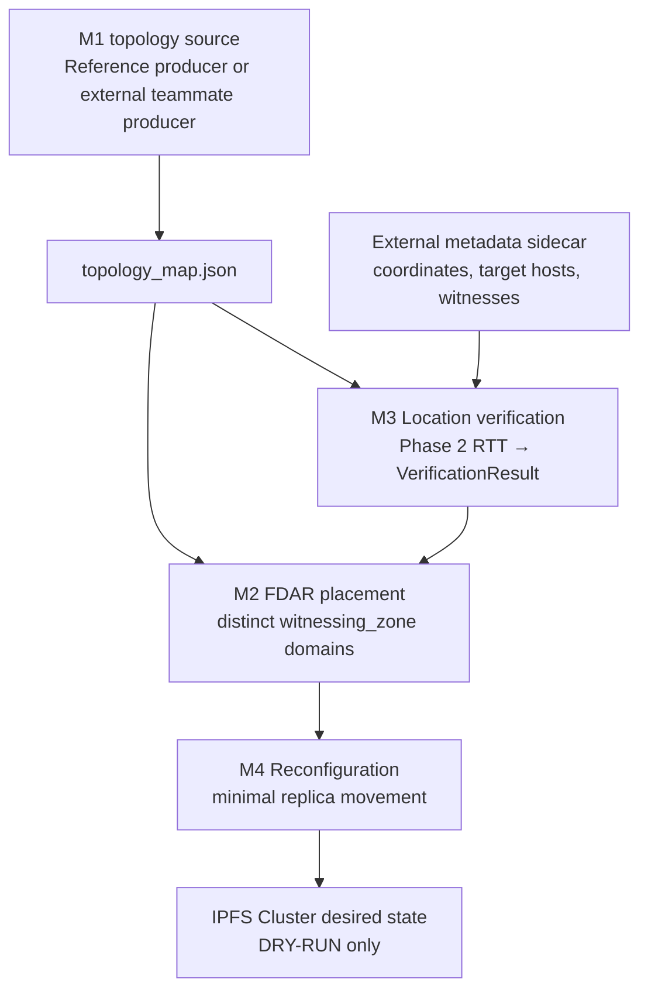
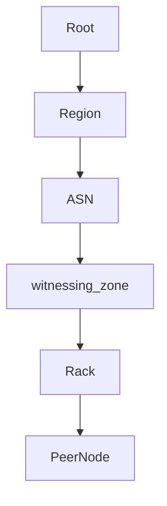

# Architecture and Phase Plan

## Purpose and integration boundary

This subsystem accepts a peer's claimed coordinates and failure-domain label, gathers evidence through independent witnesses, and returns a structured, confidence-bearing result. The result is evidence for the FDAR components; this package does not own topology modeling or replica-placement policy.

The intended call boundary is `verifier.verify(peer_claim) -> VerificationResult`. The `VerificationResult` data contract is established in Phase 1 so a later direct Python API and FastAPI adapter can share it.

## Planned evidence flow

```text
peer claim -> witness observations -> statistical features
           -> location consistency -> reliability/outlier analysis
           -> robust evidence fusion -> confidence-bearing result -> FDAR
```

Path and traceroute information, when available, will be supporting evidence only. The inference layer must account for the fact that Internet latency is affected by routing, congestion, processing, and other non-geographic factors.

## Final Architecture

```text
M1 input: flat peer claims -> repository reference producer OR teammate topology_map.json
    | Root/Region/ASN/witnessing_zone/Rack/Peer; declared failure-domain IDs and M1 states
    v
M1 adapter + explicit external coordinates/endpoint/witness metadata
    |                    \
    |                     +--> M3: Phase 2 evidence -> Phase 3 VerificationResult
    |                                                   |
    +---------------------------------------------------+
                                                        v
M2: existing Phase 4 deterministic FDAR + status-aware eligibility
    | PlacementResult
    v
M4: existing minimal reconfiguration planner
    | desired additions/removals only
    v
Phase 6 Cluster adapter: in-memory dry-run / optional loopback GET inventory

Phase 5 evaluates Phases 2-4 using seeded synthetic scenarios.
```



### Honest declared topology



### Spoofed or inconsistent claim


### Short-range ambiguity


M1–M4 are team modules. Phases 1–6 are this repository's implementation history. They are related, not identical.

## Implemented Through Phase 6

- `models.py` defines immutable claim, witness, observation, and result contracts. Observations retain an optional failure reason.
- `config.py` loads validated measurement settings and witness declarations from YAML.
- `measurement/ping.py` abstracts platform-specific, shell-free real ping calls behind `PingSource`.
- `measurement/collector.py` collects repeated samples and binds raw observations/features to witness and target IDs.
- `measurement/statistics.py` calculates descriptive features only; it has no location model.
- `measurement/storage.py` exports raw CSV and feature JSON; `measurement/traceroute.py` is optional path evidence.
- `logging_config.py` and `experiments/collect_measurements.py` support local execution.
- `tests/` use deterministic fakes and mocks; no Internet access is required.

## Phase 4 placement integration

- `placement/topology.py` stores peers under configurable physical hierarchy labels.
- `placement/eligibility.py` maps Phase 3 statuses through strict, balanced, or permissive policy.
- `placement/crush.py` performs deterministic hash-ranked, one-peer-per-domain selection.
- `placement/fdar.py` combines verification-aware eligibility/preferences with the selector and exposes a verification-blind baseline using the same domain rule.
- `placement/reconfiguration.py` plans minimal replacement while restoring current eligibility/domain constraints; it performs no movement.
- `placement/metrics.py` reports descriptive counts without claiming accuracy.
- `experiments/run_placement_simulation.py` and `compare_placement.py` use fixed synthetic inputs only.
- `inference/distance.py`, `latency_model.py`, and `residuals.py` model geography and observed-vs-expected RTT ranges.
- `inference/reliability.py`, `outliers.py`, and `fusion.py` weight evidence and flag (but retain) anomalous samples/witnesses.
- `inference/verifier.py` creates the existing `VerificationResult` and loads Phase 2 processed JSON when witness metadata is supplied separately.
- `system.py` runs Phase 3 verification for supplied claims/evidence, attaches results to topology peers, and calls existing baseline/FDAR/reconfiguration APIs.
- `integrations/ipfs_cluster.py` offers an in-memory fixture, a dry-run desired-state diff, and an optional loopback-only GET client. It has no pin mutation operation.
- `integrations/m1_builder.py` builds the documented M1 hierarchy from typed flat claims as a repository-owned reference producer; `integrations/m1_adapter.py` validates tree input and translates it to placement records. Neither substitutes for the absent teammate producer.
- `experiments/run_full_system.py` accepts either flat claims or an M1 topology map, requires either saved Phase 2 evidence or explicit `--synthetic`, and requires `--dry-run`.

Each witness runs its own collection against the target. The `PingSource` protocol allows a future simulated source to supply the same `PingResult` interface without changing the collector.

## IPFS Cluster boundary

IPFS Cluster remains the peer and pin coordination layer. The project maps Cluster peer IDs to `PeerClaim` plus externally supplied coordinates/failure-domain metadata; Cluster itself does not supply authenticated physical location. `VerificationResult` is trust/evidence metadata maintained by this project. `PlacementResult` and `ReconfigurationPlan` represent desired replica allocation and proposed changes. No live pin update, data movement, or destructive API operation is implemented.

## Phase 5 evaluation

- `experiments/` provides seeded scenarios, synthetic Phase 2 evidence generation passed through the Phase 3 verifier, and execution through existing Phase 4 baseline/FDAR/reconfiguration APIs.
- Evaluation metrics, aggregation, JSON/CSV serialization, and nine research-style plots—including synthetic coordinate-mismatch distance sensitivity—are isolated from the algorithms they evaluate.
- Generated actual/claimed domain labels provide explicitly synthetic ground truth; checked-in loopback data is not used as geographic ground truth.

## Phase history

1. Core models, configuration, logging, and tests.
2. Repeated network measurement and descriptive evidence export.
3. Location-consistency inference and evidence fusion.
4. Verification-aware failure-domain placement and reconfiguration planning.
5. Deterministic synthetic system evaluation and research-style outputs.
6. System orchestration, safe adapter boundary, dry-run demonstration, and release validation.

## Research framing and limitations

The project adapts distributed multi-witness and evidence-aggregation ideas to physical failure-domain verification for IPFS replication. It does not claim to reproduce the referenced Proof-of-Location work or to be the first location-verification system. Latency plausibility is not cryptographic proof of physical presence. Short-distance ambiguity, routing anomalies, compromised or correlated witnesses, sparse witness coverage, and unavailable targets remain fundamental limitations to evaluate.

Phase 2 records measurements; Phase 3 estimates consistency and produces uncalibrated evidence-strength scores. Neither phase cryptographically proves location or decides placement policy.

Phase 6 composes the existing phase APIs only. The optional local HTTP adapter is read-only, loopback-restricted, and requires an explicit `--live` command; default demos use synthetic evidence and an in-memory dry-run adapter.

M1 adapter details and three topology cases are documented in [m1_adapter.md](m1_adapter.md). The actual teammate-owned M1 implementation was not included in this workspace; current adapter validation targets the brief's schema and the labeled examples only.
