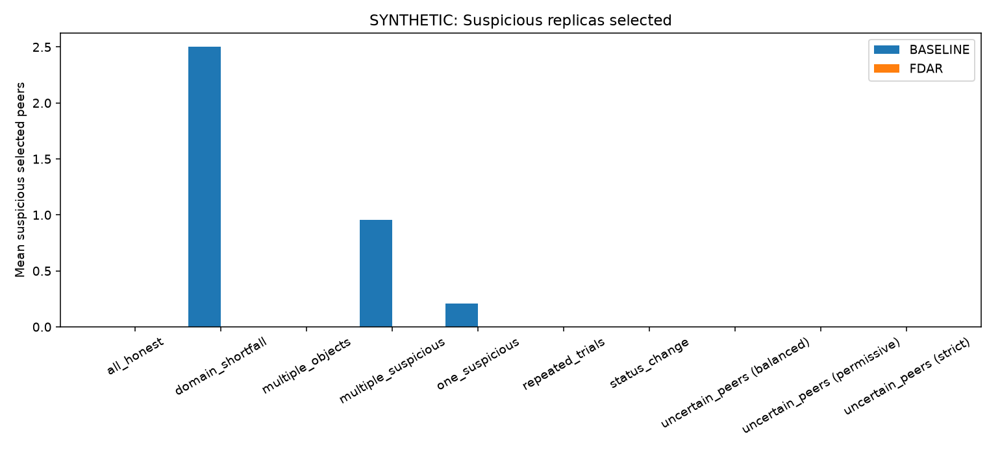
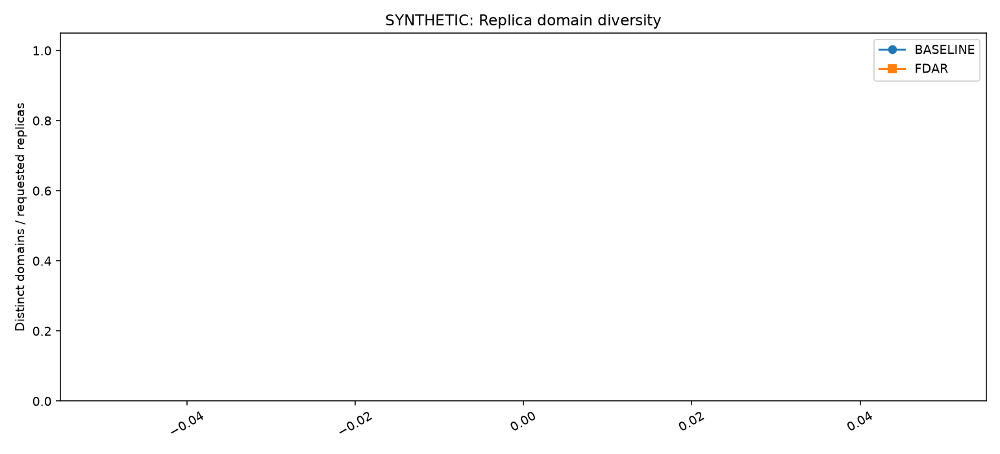
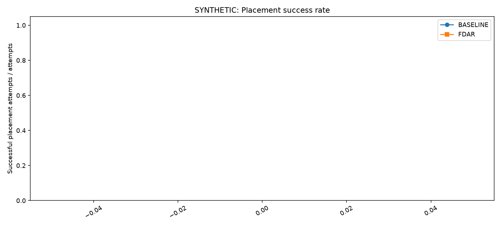
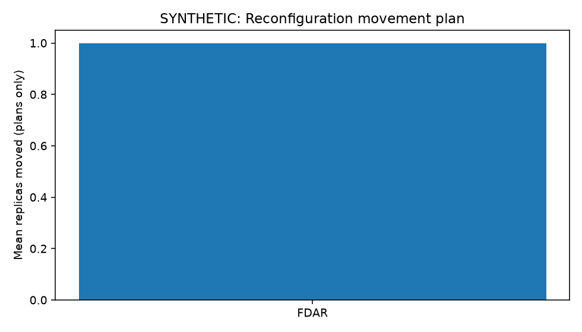
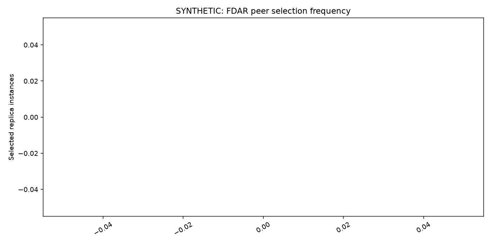
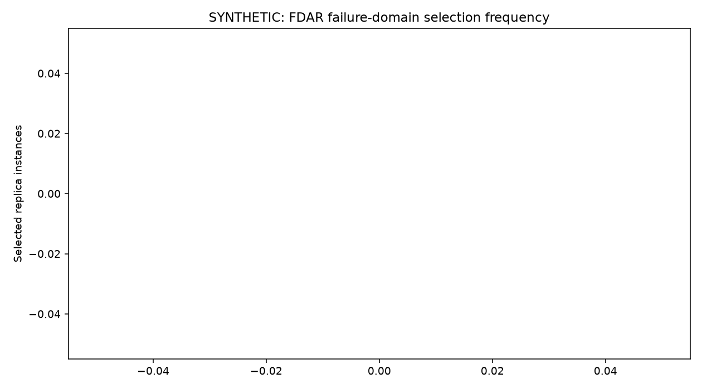
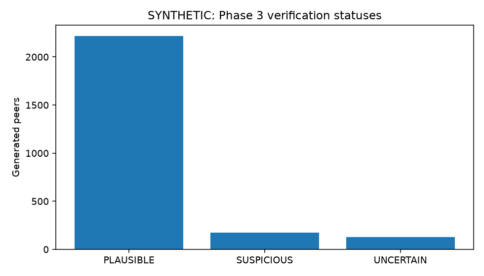
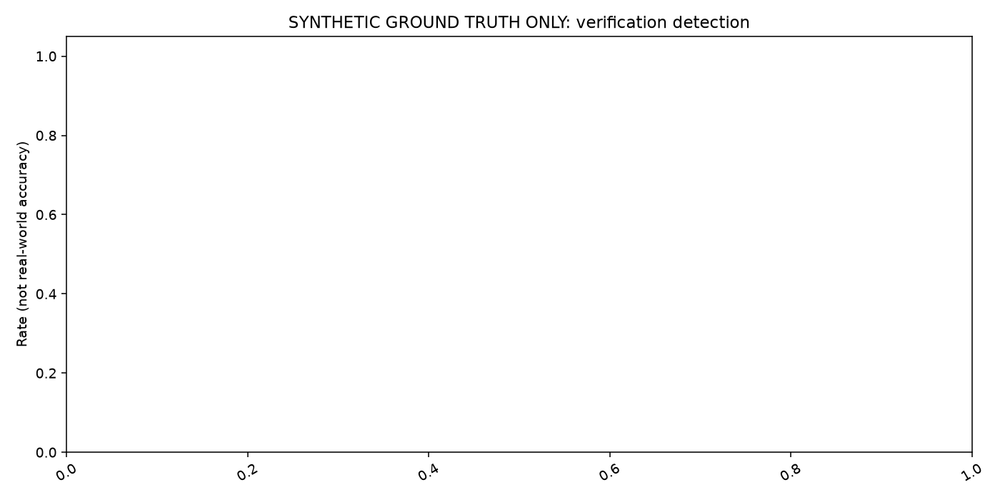
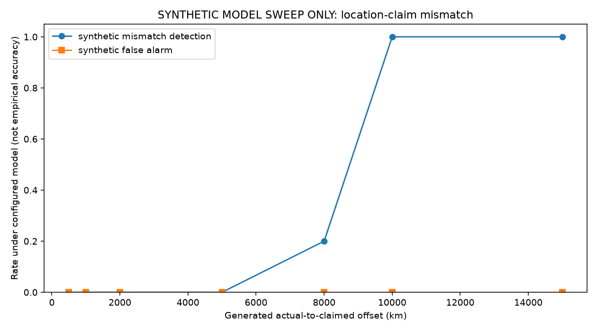

# Synthetic evaluation results

These figures show **synthetic model results**. They are not measurements from campus or geographically distributed peers, field accuracy, calibrated probabilities, or proof of physical location. The configured latency assumptions, generated witness layout, and noise determine the plotted rates. See [Evaluation Engine](evaluation_engine.md) for the metric definitions and limitations.

Plots 1–8 come from the seeded synthetic evaluation suite. Plot 9 comes from a separate 30-trial location-mismatch sweep. The committed PNG files are in [`docs/figures/synthetic-distance-sweep/`](figures/synthetic-distance-sweep/).

## Terms used in the charts

- **Peer:** a generated IPFS node that can hold a replica.
- **Replica:** one copy of the content. The evaluation requests three replicas.
- **Failure domain:** a generated infrastructure group, such as a building, whose peers are treated as sharing a possible failure risk.
- **Baseline:** deterministic hash-ranked placement that uses availability and the domain constraint but ignores verification results.
- **FDAR:** verification-aware deterministic placement. It applies the configured eligibility policy and seeks distinct failure domains.
- **Suspicious:** a Phase 3 verification status. It means the generated RTT evidence conflicts with a claim under the configured model; it does not prove deception.
- **Rate:** a fraction from 0 to 1. For example, 0.2 means 20% of the cases included in that metric.
- **Synthetic ground truth:** the actual/claimed labels generated for the experiment. This is known only inside the simulation.

## Plots

### 1. Suspicious replicas selected



**X-axis — Scenario.** Each category is a generated setup: `all_honest` has matching claims; `distance_sweep` varies a generated location offset; `domain_shortfall` has too few eligible domains; `multiple_objects` reuses a peer pool for many objects; `multiple_suspicious` and `one_suspicious` introduce several or one generated mismatch; `repeated_trials` repeats trials; `status_change` changes a verification result after placement; `uncertain_peers` makes evidence uncertain.

**Y-axis — Mean suspicious selected peers.** The average count of selected replicas whose generated peer received the `SUSPICIOUS` verifier status. It is a count per placement, not a percentage.

**Bars — Blue is BASELINE; orange is FDAR.** A taller bar means that method selected more peers classified as suspicious. In `one_suspicious`, the baseline average is about 0.2 and FDAR is zero in these generated records. Both are zero for `all_honest`, as expected in this setup.

**How to read it.** The plot illustrates how verification-aware eligibility can change replica choices. `distance_sweep` combines multiple offsets into one scenario average, so use Plot 9 to see the offset-specific behavior. A zero bar describes these records; it does not prove FDAR will always avoid suspicious peers in real networks.

### 2. Replica domain diversity



**X-axis — Scenario and, for uncertain peers, policy.** The categories are the generated setups described above. `uncertain_peers (strict)`, `(balanced)`, and `(permissive)` are separate policy cases; the policy controls how uncertain verification results affect FDAR eligibility.

**Y-axis — Distinct domains / requested replicas.** This ratio is the number of distinct failure domains represented in the placement divided by the requested replica count of three. A value of `1.0` means all three requested replicas occupy distinct domains. About `0.67` means two distinct domains are represented relative to three requested replicas. A zero can mean no replicas were placed.

**Lines and markers — Blue circles are BASELINE; orange squares are FDAR.** Each marker is a scenario result. The connecting line is a visual guide between categories, not a timeline or continuous trend.

**How to read it.** FDAR is about `0.67` for `domain_shortfall`, showing that only two distinct eligible domains were available for three requested replicas. This is a domain-capacity shortfall, not a failure to enforce diversity. The uncertain-peer policy cases are now labeled separately; strict can produce a lower ratio when it excludes uncertain candidates, while more permissive policies can retain more candidates.

### 3. Placement success



**X-axis — Scenario and uncertain-peer policy.** This uses the same scenario categories as Plot 2. The three uncertain-peer policy cases are displayed separately.

**Y-axis — Successful placement attempts / attempts.** This fraction is the number of attempts that reached the requested three replicas divided by all counted attempts. `1.0` means every attempt reached three; `0.0` means none did.

**Lines and markers — Blue circles are BASELINE; orange squares are FDAR.** Markers give success rates for each category; connecting lines are only a visual guide.

**How to read it.** FDAR reaches zero for `domain_shortfall` because it cannot fill three replicas from distinct eligible domains in that setup. Reporting a shortfall preserves the domain constraint. For `uncertain_peers`, compare the separately labeled strict, balanced, and permissive cases; a stricter policy can reduce the eligible pool and therefore reduce the chance of filling all replicas. This is placement success, not data-transfer success.

### 4. Reconfiguration movement



**X-axis — Placement mode.** The bar is labeled FDAR because this chart summarizes the generated FDAR reconfiguration plans in the evaluation.

**Y-axis — Mean replicas moved (plans only).** This is the average count of replica assignments changed in a generated repair plan. The bar at `1` means one replica was changed on average in the counted plans.

**How to read it.** The scenario changes a peer’s status after an initial placement, then the planner proposes a repair while retaining valid replicas where possible. This is a plan only: it does not show bytes copied, transfer time, or actual movement of data. The chart does not show the number of plans contributing to the average.

### 5. Peer selection frequency



**X-axis — Peer IDs.** Each label, such as `peer-001`, identifies one generated peer.

**Y-axis — Selected replica instances.** This is the number of times the peer appears in FDAR placements across the generated `multiple_objects` and `repeated_trials` scenarios. A taller bar means more selections in those records.

**How to read it.** The counts are in a broadly similar range, with some variation. This is a descriptive count, not a fairness test: it does not normalize by each peer’s eligibility or availability opportunities.

### 6. Failure-domain selection frequency



**X-axis — Failure-domain IDs.** Labels such as `A1`, `A2`, and `B1` identify generated failure domains.

**Y-axis — Selected replica instances.** This counts selected replicas assigned to each domain across the generated `multiple_objects` and `repeated_trials` scenarios.

**How to read it.** The bars show how selection is distributed among generated domains. Some are selected more often than others. These counts do not by themselves establish fairness or resilience; they do not show how many eligible peers or placement opportunities each domain had.

### 7. Verification status distribution



**X-axis — Phase 3 verification status.** `PLAUSIBLE` means evidence meets configured consistency and quality rules; `SUSPICIOUS` means evidence conflicts with a claim under the configured model; `UNCERTAIN` means evidence is ambiguous or calls for caution.

**Y-axis — Generated peers.** This is the number of generated peer cases assigned each status, counting each generated trial/scenario group once rather than counting duplicated BASELINE and FDAR records twice. The distance-sweep offsets are not separate groups in this chart.

**How to read it.** The generated cases produce many more `PLAUSIBLE` peers than `SUSPICIOUS` or `UNCERTAIN` peers. These are scenario-driven counts, not real-world proportions. `INSUFFICIENT_EVIDENCE` does not appear because no cases with that status were included in the displayed run.

### 8. Generated-label detection and false alarms



**X-axis — Scenarios with generated mismatch labels.** The categories shown have synthetic actual/claimed labels that permit comparison with the verifier output.

**Y-axis — Rate (not real-world accuracy).** The scale runs from 0 to 1. For instance, 1.0 means all relevant generated cases in that metric were counted; 0.2 means 20%.

**Bars — Synthetic detection rate.** Of the generated mismatches, this is the share classified as `SUSPICIOUS`.

**Line — Synthetic false-alarm rate.** Of the generated non-mismatches, this is the share classified as `SUSPICIOUS`.

**How to read it.** The shown detection bars are at 1.0 and the false-alarm rate is zero in this run. Under these generated inputs, mismatches were flagged and the counted non-mismatches were not. This is not evidence of 100% real-world accuracy. The false-alarm line lies on the zero baseline and can be difficult to see; the legend also overlaps the chart near the top.

### 9. Detection by generated location offset



**X-axis — Generated actual-to-claimed offset (km).** This is the generated distance between a peer’s actual coordinates and its claimed coordinates. It is not a measurement of a real peer’s location.

**Y-axis — Rate under the configured model.** The scale from 0 to 1 gives the fraction of generated cases at that offset counted by each metric.

**Blue line — Synthetic mismatch detection.** The share of generated mismatches classified as `SUSPICIOUS` at each offset. In the checked-in 30-trial sweep, detection is 0% at 500, 1,000, 2,000, and 5,000 km; 20% at 8,000 km; and 100% at 10,000 and 15,000 km.

**Orange line — Synthetic false alarm.** The share of generated non-mismatches classified as `SUSPICIOUS`; it is 0% at each tested offset in this run.

**How to read it.** Detection rises for larger generated offsets under this witness layout and latency model. The curve is specific to those synthetic inputs and does not establish the real distance at which a location claim can be detected. Routing, congestion, witness placement, and model calibration would all affect a real measurement study.

## Reproduce

From the repository root, regenerate the full suite (Plots 1–8) and the independent 30-trial distance sweep (Plot 9):

```powershell
python experiments/run_evaluation.py --output-dir data/experiments
python experiments/run_evaluation.py --scenario distance_sweep --trials 30 --distance-sweep-km 500,1000,2000,5000,8000,10000,15000 --output-dir data/experiments/distance_sweep_extended
Copy-Item data/experiments/plots/0[1-8]_*.png docs/figures/synthetic-distance-sweep/
Copy-Item data/experiments/distance_sweep_extended/plots/09_synthetic_location_distance_sweep.png docs/figures/synthetic-distance-sweep/
```

The first command uses the scenarios, seeds, and parameters in `configs/evaluation.yaml`. The second specifies the offsets used for the 30-trial curve. Generated JSON/CSV records, manifests, and intermediate plots remain under `data/experiments/`; the selected, explicitly synthetic PNG figures are committed here.
